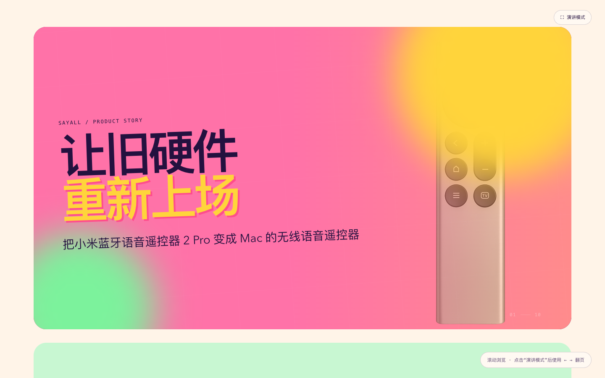
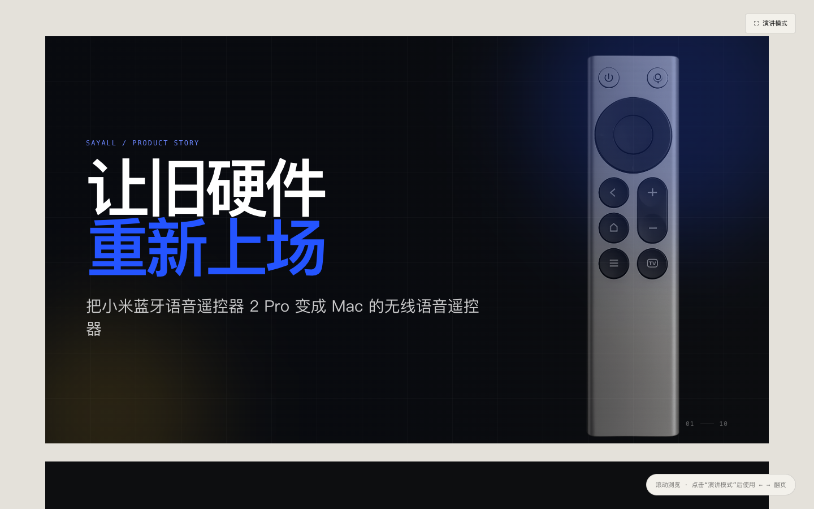
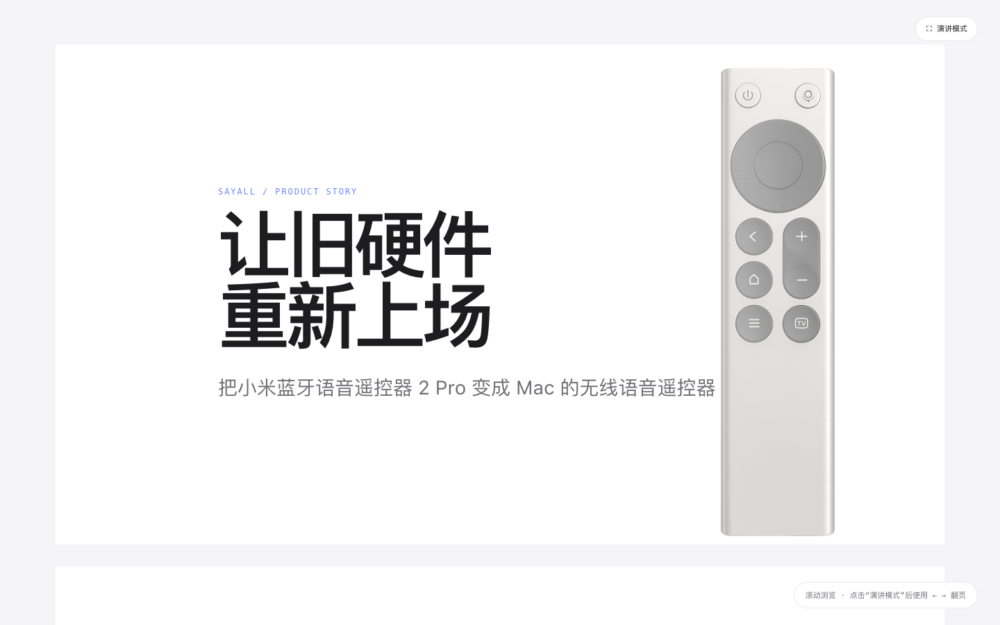
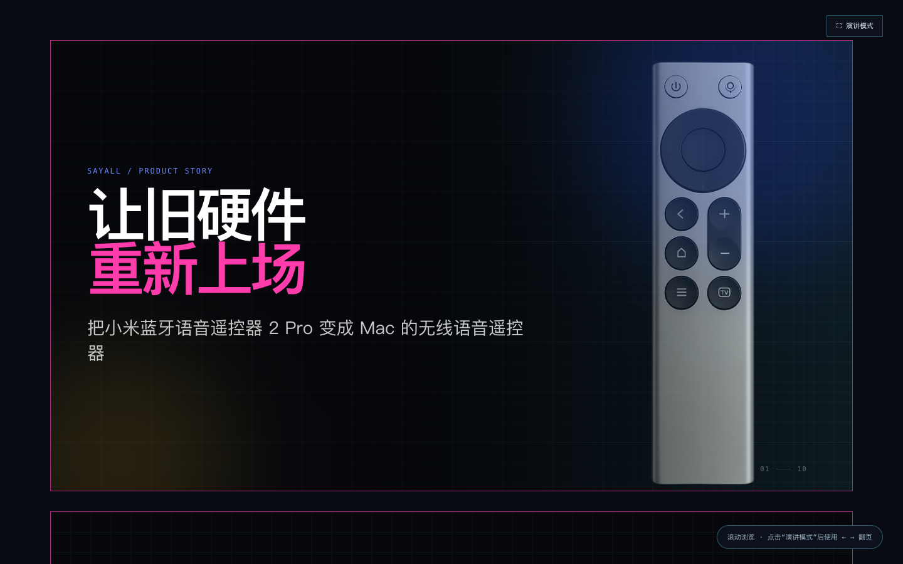

# Vibe PPT Web Template

一个用于制作“演讲式 PPT 网页”的通用前端框架。它提供固定比例幻灯片、长页浏览、演讲模式、键盘翻页、移动端缩放和可配置版式。

模板源码与默认演示内容不含任何真实人物、公司、产品、账号、二维码、头像或个人照片；所有待填充内容都是通用占位文本和占位图片。README 顶部的图片是公开成品范例截图，不属于模板默认内容。

## 在线范例

以下成品使用同一套框架与内容生成，展示不同主题在布局、字体、色彩和图片表达上的差异。点击截图可打开完整 PPT 网页。

| 多巴胺 | 编辑纸张 |
| --- | --- |
| [](https://ppt.sayall.app/) | [](https://1.ppt.sayall.app/) |
| [打开 `ppt.sayall.app`](https://ppt.sayall.app/) | [打开 `1.ppt.sayall.app`](https://1.ppt.sayall.app/) |

| 苹果风 | 赛博朋克 |
| --- | --- |
| [](https://2.ppt.sayall.app/) | [](https://3.ppt.sayall.app/) |
| [打开 `2.ppt.sayall.app`](https://2.ppt.sayall.app/) | [打开 `3.ppt.sayall.app`](https://3.ppt.sayall.app/) |

范例截图来自公开演示站点，仅用于展示模板能力；演示项目的原始内容和素材不包含在本仓库中。

## 快速开始

```bash
npm install
npx playwright install chromium
npm run validate
npm run qa:layout
npm run dev
```

也可以用 Markdown 生成内容文件：

```bash
npm run import:markdown -- examples/sample-apple.md
```

主题规范见 [`THEME_GUIDE.md`](THEME_GUIDE.md)。内置主题 ID 为 `default`、`apple`、`dopamine`、`cyberpunk`；Markdown frontmatter 未写 `theme` 时自动使用 `default`。

每套主题拥有独立的标题比例、页面边距、图文构图、图片框架和卡片结构。Markdown 可用 `layout`、`imageRatio`、`imageFit`、`imagePosition`、`backgroundImage` 和 `backgroundPosition` 控制单页图片表达，完整字段见 [`CONTENT_GUIDE.md`](CONTENT_GUIDE.md)。

然后打开终端显示的本地地址。生产构建：

```bash
npm run build
```

## 你应该从哪里开始

- 内容入口：[`src/content.js`](src/content.js)
- 人类与 AI 的填充规则：[`CONTENT_GUIDE.md`](CONTENT_GUIDE.md)
- 常见问题与发布前排查：[`TROUBLESHOOTING.md`](TROUBLESHOOTING.md)
- 可直接复制的 AI 提示词：[`AI_PROMPT_TEMPLATE.md`](AI_PROMPT_TEMPLATE.md)
- 本地素材说明：[`public/assets/README.md`](public/assets/README.md)
- 结构校验：[`scripts/validate-content.mjs`](scripts/validate-content.mjs)
- 逐主题布局验收：[`scripts/qa-layout.mjs`](scripts/qa-layout.mjs)
- Markdown 导入：[`scripts/markdown-to-content.mjs`](scripts/markdown-to-content.mjs)

## 已有交互

- 滚动模式：按顺序浏览所有幻灯片。
- 滚动入场：页面进入视口后，标题、正文、卡片和图片按主题节奏分层出现。
- 演讲模式：使用 `←`、`→`、`PageUp`、`PageDown`、空格、`Home`、`End` 翻页，并保留页面交叉淡入淡出。
- `Escape`：退出演讲模式。
- 项目画廊：右侧同时保留叠放卡片，点击左侧条目后用层级、旋转和位移动画重排主卡。
- 结束页画廊：可配置两条反向无缝滚动的图片轨道，适合展示作品、截图或社交内容封面。
- 结束页入口：可在左侧配置 1–2 张大尺寸二维码、海报或入口图片，保持原始图片完整展示，并与右侧滚动画廊组成 50/50 布局。
- 减少动态效果：遵循系统 `prefers-reduced-motion` 设置，关闭连续装饰动画并缩短页面切换。

## 版式类型

`cover`、`profile`、`gallery`、`chapter`、`pipeline`、`stat`、`flow`、`roadmap`、`reviews`、`skills`、`closing`、`outro`。

每页使用一个 `type`，由 `src/App.jsx` 选择对应渲染器。填充内容时优先复用已有类型；只有多个页面都需要同一新结构时，才扩展渲染器和样式。

## 隐私与素材边界

- 不要提交 `.env`、凭据、Cookie、密钥、真实二维码或未经授权的用户反馈。
- 不要把个人照片、原始聊天记录或私有客户数据复制进模板仓库。
- 素材必须保存为实际文件，放在 `public/assets/`，不要使用远程热链或 Base64。
- 这是一个前端模板，不包含后端、数据库或账号系统。

## 发布前布局门禁

`npm run qa:layout` 会启动真实 Chromium，在 `default`、`apple`、`dopamine`、`cyberpunk` 四套主题中逐页进入演讲模式并检查：

- 图片是否加载成功；
- 内容是否越过幻灯片边界；
- 被 `hidden` / `auto` / `scroll` 实际裁切的文字；
- 文字与图片、相邻文字块是否发生实质重叠；
- 纯色背景上的文字对比度是否达到 WCAG 基线；
- 深色 Profile 版式在 `dark`、`paper`、`split` 外层表面下是否仍保持可读。
- 演讲模式是否只有一个活动页、是否保留交叉淡出，以及页内元素是否应用入场动画。
- `prefers-reduced-motion` 是否关闭连续动画并正确降级。
- 在 16:10 视口中，演讲模式是否真正贴合视口四边，避免固定 16:9 造成顶部或底部留白。

字体的字形行盒可能让 `scrollHeight` 略大于 `clientHeight`。只有元素自身会裁切溢出内容时才算失败，不能仅凭两者差值判断文字被截断。自动布局验收截图保存在系统临时目录，不进入仓库。

## License

本项目采用 [MIT License](LICENSE)。
